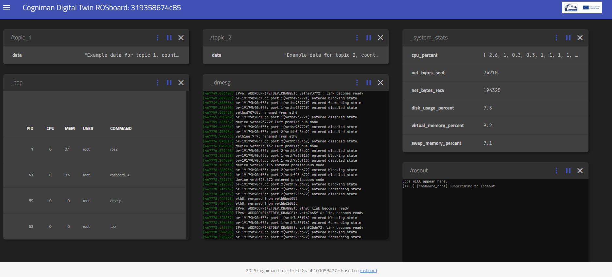

# Pilot02 Digital Twin ROSBoard

This repository contains a docker based version of rosboard. It includes some changes on top of the original ROSboard (https://github.com/dheera/rosboard) project with visual branding and improved robustness for ROS2 message handling.

Features:
- Web-based visualization of ROS1/ROS2 topics
- Mobile-friendly interface
- Lightweight and resource-efficient
- Compatible with live ROS nodes and ROS bag file playback
- Easily extensible with custom .js visualizations

## Description

The repository includes the following components:
- Docker setup for easy containerization
- A Docker Compose-based test environment to verify end-to-end functionality

## Guidelines for build and test the component 

### 1. **Build the Main Docker Image:**

In this step, we build the Docker image using the provided `Dockerfile`. The image is named `pilot02-digitaltwin-rosboard`.

```bash
cd rosboard
docker build -t pilot02-digitaltwin-rosboard .
```
Make sure the path to your configuration file is correctly mapped to the Docker container.

### 2. **Run the ROS 2 Container:**

After building the Docker image, you can run the container using the following command:

```bash
docker run pilot02-digitaltwin-rosboard
```

This will start the container and launch the Bag Player with the configuration given. Change the bag log filename if you want to play a different one.

### 3. **Build and Run the test automation:**

Test automation is integrated by docker-compose file:

Run: 
```bash
docker-compose up --build
```
After execution, you will be able to see at [Rosboard →](https://localhost:8888) the web based board. By default only two topics with sample data are shown.




Please note that, due to the large size of ROS bag files containing rich data (such as images, LiDAR point clouds, or video streams), example files with this type of content are not included in the repository. You can use your own ROS2 bag files with these types of data to explore more advanced visualizations.

## Contributing

Feel free to open issues or submit pull requests. Contributions are welcome!

## License

This project is licensed under BSD 3-Clause License - see the [LICENSE](LICENSE) file for details.